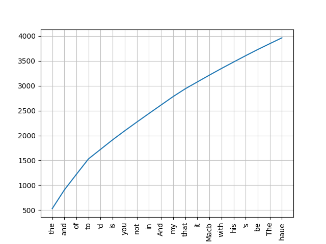
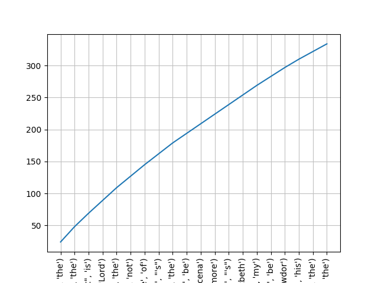
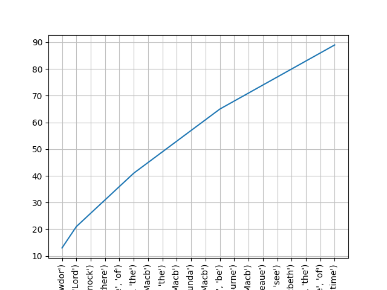

# CS565: Assignment-1

## Basic pre-processing: Segmentation, N-Gram Analysis, Collocation

### Part 1: Getting Started

**Q1** 
Download any freely available corpus or take any accessible corpus from your chosen tool. Explore available sentence segmenter from the tool and use that for sentence segmentation.

**Tool**: Python3 NLTK library (Version 3.2.2)  
**Corpus**: Macbeth by Shakespeare (Available in ``gutenberg`` collection of  NLTK library
**Sentence Segmenter**: NLTK includes implementation of Punkt sentence segmentation [Kiss & Strunk, 2006](http://www.mitpressjournals.org/doi/abs/10.1162/coli.2006.32.4.485#.WJCTQVcnPCI)  
**Sentence Segmentation**: Total number of sentences in corpus is 1907.

---

**Q2**
Create a dictionary after detecting words from all sentences.

**Assumption**: *word* here means any sequence of one or more characters.

Total number of words in corpus is 22211.
Total number of unique words in corpus is 4094.
---

**Q3**
Find all possible unigrams. For each unigram, calculate its frequency in the given corpus. Plot the frequency distribution.

**Assumption**: . A single character token (Eg. `,`, `.`, `\`, `:`) is not considered unigram calculation in the answer.

Total number of unigrams in corpus is 11740.

20 most common unigrams in the frequency distribution are:

| unigram  | count |
|------|-----|
| the  | 530 |
| and  | 375 |
| of   | 315 |
| to   | 310 |
| 'd   | 192 |
| is   | 192 |
| you  | 181 |
| not  | 175 |
| in   | 172 |
| And  | 170 |
| my   | 170 |
| that | 156 |
| it   | 138 |
| Macb | 137 |
| with | 134 |
| his  | 129 |
| 's   | 128 |
| be   | 124 |
| The  | 118 |
| haue | 117 |  

**Frequency Plot**:  

---

**Q4**
Find all possible bigrams and calculate their frequencies. Plot the frequency distribution.

**Assumption**: . A single character token (Eg. `,`, `.`, `\`, `:`) is not considered unigram calculation in the answer.

Total number of bigrams in corpus is 17439.

20 most common bigrams in the frequency distribution are:

| bigram  | count |
|------|-----|
| ('of', 'the') | 24 |
| ('to', 'the') | 24 |
| ("'t", 'is') | 21 |
| ('my', 'Lord') | 20 |
| ('in', 'the') | 20 |
| ('can', 'not') | 18 |
| ('Thane', 'of') | 18 |
| ('ha', "'s") | 17 |
| ('and', 'the') | 17 |
| ('to', 'be') | 15 |
| ('Exeunt', 'Scena') | 15 |
| ('Enter', 'Macbeth') | 15 |
| ('no', 'more') | 15 |
| ('of', 'my') | 15 |
| ('do', "'s") | 15 |
| ('not', 'be') | 14 |
| ('of', 'Cawdor') | 14 |
| ('in', 'his') | 13 |
| ("'d", 'with') | 12 |
| ('from', 'the') | 12 |

**Frequency Plot**:

---

**Q5**
Similarly find all trigrams possible and calculate their frequencies. Plot the frequency distribution.

Total number of trigrams in corpus is 17438.

20 most common trigrams in the frequency distribution are:

| trigram  | count |
|------|-----|
| ('Thane', 'of', 'Cawdor') | 13 |
| ('my', 'good', 'Lord') | 8 |
| ('Knock', 'Knock', 'Knock') | 5 |
| ('Who', "'s", 'there') | 5 |
| ('the', 'Thane', 'of') | 5 |
| ('What', "'s", 'the') | 5 |
| ('my', 'Lord', 'Macb') | 4 |
| ('can', 'not', 'be') | 4 |
| ('good', 'Lord', 'Macb') | 4 |
| ('Enter', 'Macbeth', 'Macb') | 4 |
| ('Exeunt', 'Scena', 'Secunda') | 4 |
| ('This', 'is', 'the') | 4 |
| ('to', 'Night', 'Lady') | 3 |
| ('And', 'to', 'be') | 3 |
| ('Exeunt', 'Scena', 'Quarta') | 3 |
| ('the', 'three', 'Witches') | 3 |
| ('Rosse', 'and', 'Angus') | 3 |
| ('trouble', 'Fire', 'burne') | 3 |
| ('bed', 'to', 'bed') | 3 |
| ('you', 'haue', 'done') | 3 |

**Frequency Plot**:

---

**Q6**
Each group is expected to explore two tools (e.g. NLTK and Apache OpenNLP).
